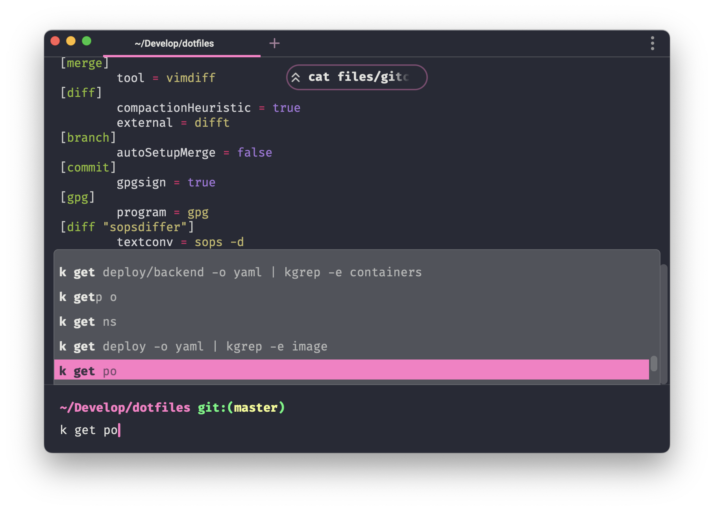

# Dotfiles

## Requirements

- `git` to clone this repository

## Setup

1. Run `make install-ansible` to installs [Homebrew](brew.sh) and [Ansible](ansible.com)
3. Optional: Run `make install-soft` where "soft" is filename from tasks folder (without extension)
2. Optional: Run `make install-all` to install everything
